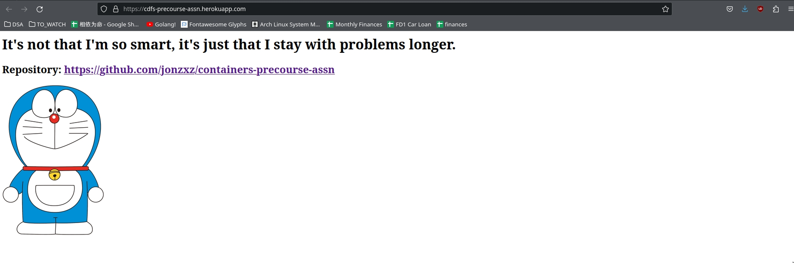

# workshop01
- This assignment (attempts) to fulfill the 6 (excluding the last, submission task) tasks required for the workshop.
- This includes
		
    1. [Public git repository](https://github.com/jonzxz/containers-precourse-assn)
		
    1. Subdirectory `workshop01` containing the assignment itself
		
    1. Simple web application written in Python and Flask, hosted by Gunicorn
				- Containing randomized phrases that will be refreshed every time
				- Link to the repository
				- An image (Doraemon!)
		
    1. Dependencies listed in `requirements.txt`
		
    1. Gitignore added to ignore pycache and Python virtual environment
		
    1. Application Deployment
				- Application is deployed on Heroku [here](https://cdfs-precourse-assn.herokuapp.com/)
				- There is some really nasty hack going on because Heroku requires the Procfile and requirements.txt to be in the root directory.
					- For the Heroku deployment that is done using Heroku CLI, a `git subtree push` with the `--prefix workshop01` was done so that Heroku interprets this folder as the root directory.

## Proof of Work
